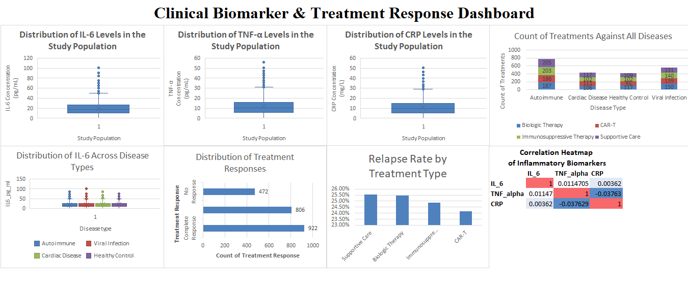

# Data-analytics-projects
A curated collection of biological data analysis projects demonstrating data preprocessing, exploratory analysis, and insight generation from experimental and life-science datasets.
<br>
Analyst - Kamran Saeed
# Clinical Biomarker & Treatment Response Dashboard

## 📌 Project Overview
This project presents a comprehensive **clinical data analysis and visualization dashboard** focused on inflammatory biomarkers and treatment outcomes across multiple disease categories. The analysis explores biomarker distributions, treatment usage patterns, response outcomes, relapse rates, and correlations to support data-driven insights in biomedical and clinical research.

The dashboard was designed using **Microsoft Excel** with advanced charting and descriptive analytics, making it accessible for clinicians, researchers, and data analysts.

---

## 📊 Dataset Description
- **Dataset size:** 2,200 clinical records  
- **Domain:** Biomedical / Clinical Analytics  
- **Key Variables:**
  - Inflammatory biomarkers: **IL-6, TNF-α, CRP**
  - Disease categories: Autoimmune, Cardiac Disease, Viral Infection, Healthy Control
  - Treatment types: Biologic Therapy, Immunosuppressive Therapy, CAR-T, Supportive Care
  - Clinical outcomes: Treatment response, relapse status

---

## 📈 Dashboard Features
The dashboard includes the following analytical components:

### 🔬 Biomarker Analysis
- Distribution of **IL-6**, **TNF-α**, and **CRP** levels across the study population
- Comparative distribution of **IL-6 levels by disease type**
- Identification of variability and outliers in inflammatory markers

### 💊 Treatment Analysis
- Count of treatments across all disease categories
- Distribution of treatment responses (Complete, Partial, No Response)
- **Relapse rates by treatment type**

### 🔗 Correlation Analysis
- Heatmap showing correlations between:
  - IL-6
  - TNF-α
  - CRP  
- Helps identify relationships between inflammatory biomarkers

---

## 🖥️ Dashboard Preview
Below is a snapshot of the Excel-based dashboard:




---

## 🛠️ Tools & Technologies
- **Microsoft Excel**
  - Pivot Tables
  - Statistical summaries
  - Box plots, bar charts, heatmaps
- **Data Analysis Techniques**
  - Descriptive statistics
  - Exploratory Data Analysis (EDA)
  - Correlation analysis

---

## 📂 Repository Structure
```text
├── biomedical_large_dataset_2200_rows.xlsx
├── README.md
├── dashboard_screenshot.png
└── sheets/
    ├── Biomarker_Distributions
    ├── Descriptive_Statistics
    └── EDA
